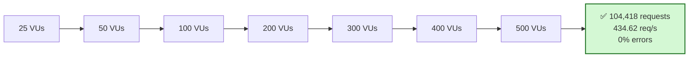
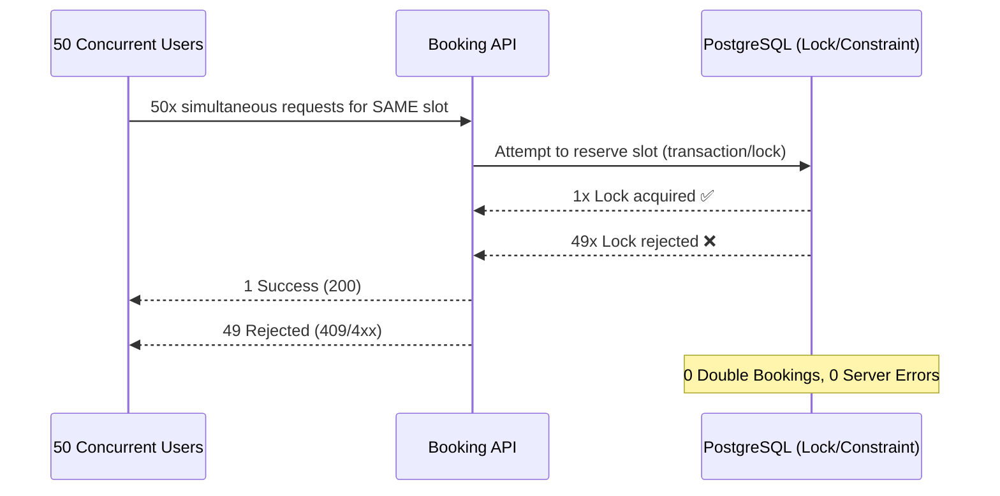

# K6 Grafana Load Testing Reports

Targeted [Grafana k6](https://grafana.com/docs/k6/latest/) performance and concurrency tests for the Calendly backend.

> **Test Environment:** Local development environment running on **Windows 11**, Intel Core i5-12450H (**8 cores / 12 threads**), **16 GB RAM**. PostgreSQL and Temporal were running locally in Docker during the tests.

---

## 1. Public Event Type — Stress Test

**Achievement:** Handled up to **500 VUs** and **104K requests** at **434 req/s** with **0% HTTP errors** and **100% application success**.

```text
25 VUs ➔ 50 VUs ➔ 100 VUs ➔ 200 VUs ➔ 300 VUs ➔ 400 VUs ➔ 500 VUs
```

### Load Ramp Diagram



### Key Metrics

| Metric | Result |
| :--- | :--- |
| **Peak Load** | 500 VUs (104,418 total requests) |
| **Throughput** | 434.62 req/s |
| **Latency (p95 / p99)** | 918.92 ms / 1.18 s |
| **Success Rate** | 100% (0% HTTP errors) |

### Analysis

- Scaled linearly from 25 → 500 VUs with **0% errors**, indicating no connection exhaustion or crashes under load.
- p95/p99 gap is tight (~260ms), meaning latency degrades gradually rather than spiking at the tail.

---

## 2. Booking — Same-Slot Concurrency Test

**Achievement:** Guaranteed zero double-bookings under contention — **50 simultaneous users** resulted in **exactly 1 successful booking and 49 rejections** with **0 server errors**.

```text
50 Concurrent Users ➔ Same Slot ➔ [ 1 Success | 49 Rejected ] ➔ 0 Double Bookings
```

### Concurrency Resolution Diagram



### Key Metrics

| Metric | Result |
| :--- | :--- |
| **Concurrent Users** | 50 VUs |
| **Successful / Rejected** | 1 Booked / 49 Rejected |
| **Double Bookings** | 0 |
| **Server Errors** | 0% |
| **p95 Latency** | 318.43 ms |

### Analysis

- Validates correctness under a race condition: 1 success / 49 graceful rejections, 0 double-bookings, 0 server errors.
- Confirms DB-level locking/constraints hold up under simultaneous write contention on a single resource.

---

## Environment & Run Commands

- **Stack:** Node.js, PostgreSQL, Temporal (Docker), Windows 11 (i5-12450H, 16GB)

```bash
# Public Event Stress Test
k6 run ./k6/01_get_public_event_type.js

# Booking Concurrency Test
k6 run ./k6/02_concurrent_book_slot.js
```